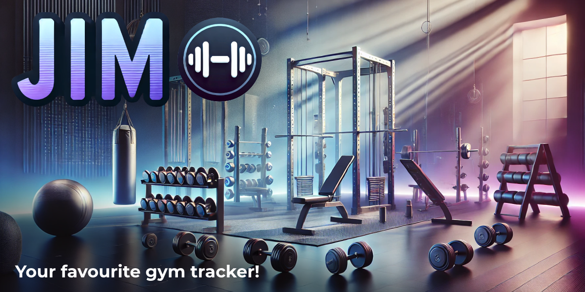

# Jim

## Your favourite gym tracker!

### MVP - Milestone 1

- [x] User should be able to create their own custom exercises.
- [x] User should be able to create workout routines.
- [x] User should be able to start an empty workout or a workout routine.
- [x] User should be able to follow another user.
- [x] User should be able to exit an active workout and resume/discard it later.
- [x] User should be able to log sets/reps/etc on the exercises while in a workout.
- [ ] User should be able to create a post of their workout when they're finished.
- [ ] User should be able to see other users workouts in their Home feed.

### Milestone 2

- [ ] User can edit/delete custom exercises without breaking old routines and workouts.
- [ ] User should be able to add/remove/reorder/superset exercises while in a workout.
- [ ] User should be able to edit/delete their own custom exercises.
- [ ] User should be able to edit/delete their own routines.
